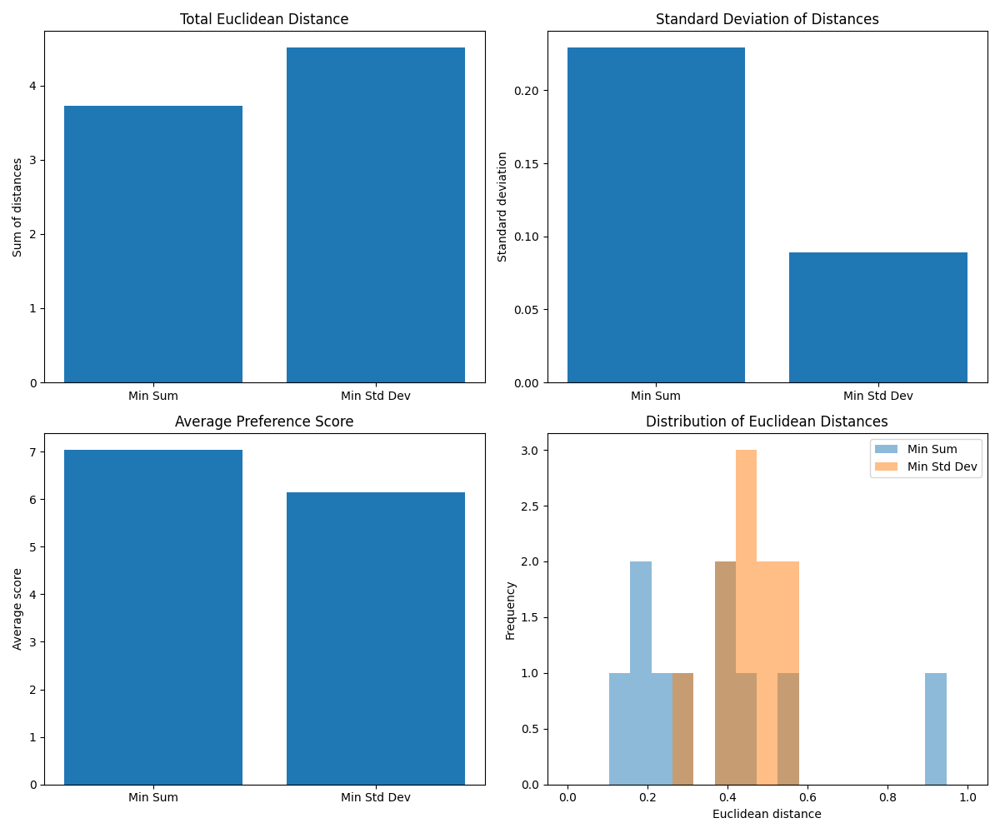

# Optimization Strategies for Prom Date Matching: Balancing Preferences and Compatibility

**Platonic Prom Committee**

## Abstract

This paper presents a comparative analysis of optimization strategies for matching platonic friends as prom dates. We implemented a system that uses simulated annealing to find optimal pairings based on stated preferences and computed compatibility metrics. Two optimization objectives were examined: minimizing the sum of Euclidean distances (optimizing for efficiency) and minimizing the standard deviation of distances (optimizing for equity). Our results show that the choice of objective function has significant implications for match quality and fairness. The distance-minimizing approach produced better average matches with higher preference satisfaction but greater variability, while the standard deviation-minimizing approach ensured more consistent match quality across all participants. This study provides insights into the trade-offs between efficiency and equity in matching problems and offers practical guidance for implementing fair allocation systems.

**Keywords**: Simulated annealing, matching algorithms, optimization, fairness, preference modeling, one-hot encoding

## 1. Introduction

Matching algorithms play a critical role in numerous real-world applications, from allocating medical residents to hospitals to pairing users on dating platforms. This paper focuses on a specific application: matching platonic friends as prom dates while considering both stated preferences and computed compatibility.

The problem is formulated as follows: given a group of students with expressed preferences for potential prom partners and a set of attributes (height, activity preferences, music tastes, personality traits), find a one-to-one matching that optimizes overall satisfaction. This presents an interesting optimization challenge that balances multiple objectives:

- Maximizing preference satisfaction based on explicit ratings
- Optimizing compatibility based on attribute similarity/complementarity
- Ensuring fairness across all participants

We examine two distinct optimization objectives: minimizing the total Euclidean distance between matched pairs (a measure of efficiency) and minimizing the standard deviation of these distances (a measure of equity). Through experimental evaluation using simulated data, we demonstrate the trade-offs inherent in these approaches and provide recommendations for real-world applications.

## 2. Related Work

Matching problems have a rich history in computer science and economics, beginning with the seminal work of Gale and Shapley on stable matching. Subsequent research has extended these foundations to various domains, including school choice, kidney exchange, and online dating.

Simulated annealing, first introduced by Kirkpatrick et al., has proven effective for combinatorial optimization problems like the one addressed in this paper. It has been successfully applied to matching problems in various contexts, including employee scheduling and team formation.

The fairness aspects of matching algorithms have received increasing attention in recent years. Our work contributes to this literature by explicitly comparing efficiency-focused and equity-focused optimization objectives in the context of prom date matching.

## 3. Methodology

### 3.1 Problem Formulation

We formulate the prom matching problem as follows: given sets of male and female students M and F, each with attributes and preferences, find a one-to-one matching μ: M → F that optimizes an objective function J(μ). Each student has both explicit preference ratings for potential matches and a feature vector representing their attributes.

### 3.2 Feature Engineering

Each student is represented by a feature vector that combines:

- Normalized numeric attributes (height)
- One-hot encoded categorical attributes (activity preferences, music tastes, personality)

Proper normalization is critical for meaningful Euclidean distance calculations. We apply min-max scaling to numeric attributes:

```
x_norm = (x - x_min) / (x_max - x_min)
```

For categorical features, we use one-hot encoding and apply a weighting factor to balance their influence relative to numeric features:

```
w_cat = 1 / n_categories
```

where n_categories is the total number of unique categorical values across all categorical features.

### 3.3 Optimization Objectives

We investigate two optimization objectives:

**Minimize Sum of Distances (Efficiency):**
```
J_sum(μ) = Σ ||v_i - v_μ(i)||_2
```

where v_i and v_μ(i) are the feature vectors of student i and their match μ(i).

**Minimize Standard Deviation (Equity):**
```
J_std(μ) = sqrt(1/|M| * Σ(||v_i - v_μ(i)||_2 - d_avg)²)
```

where d_avg is the mean distance across all matched pairs.

We then combine these objectives with preference satisfaction in a weighted sum:

```
J(μ) = w_pref · J_pref(μ) + w_dist · J_dist(μ)
```

where J_pref(μ) is the preference satisfaction score and J_dist(μ) is either J_sum(μ) or J_std(μ) depending on the chosen objective.

### 3.4 Simulated Annealing Algorithm

We implement simulated annealing to find optimal matchings. The algorithm works as follows:

1. Initialize temperature T = T₀
2. Generate random initial matching μ_current
3. Set μ_best ← μ_current
4. While T > T_min and iterations < max_iterations:
   a. Generate neighbor solution μ_neighbor by swapping two pairs
   b. ΔE ← J(μ_neighbor) - J(μ_current)
   c. If ΔE > 0 or random(0,1) < e^(ΔE/T):
      i. μ_current ← μ_neighbor
      ii. If J(μ_current) > J(μ_best):
          μ_best ← μ_current
   d. T ← T × cooling_rate
5. Return μ_best

Key implementation details:
- Neighbor Generation: We swap female partners between two randomly selected male students to maintain the one-to-one matching constraint.
- Cooling Schedule: We use an exponential cooling schedule with cooling_rate = 0.995.
- Initial Temperature: Set high enough (T₀ = 100.0) to allow exploration of the solution space.

Figure 1 compares the execution of the simulated annealing process for both optimization approaches, showing the evolution of scores, temperature decay, standard deviation changes, and match patterns over iterations.


*Figure a: Comparison of the simulated annealing process for the Minimize Sum approach (left) and the Minimize Standard Deviation approach (right).*

## 4. Experimental Results

### 4.1 Dataset

We generated synthetic data for 10 male and 10 female students, each with:
- Numeric attributes: height (155-190 cm)
- Categorical attributes: preferred activities, music preferences, personality traits
- Preference ratings: 1-10 scale ratings for each potential match

### 4.2 Comparison of Optimization Objectives

Table 1 summarizes the key performance metrics for both optimization objectives:

| Metric | Minimize Sum | Minimize Std Dev |
|--------|--------------|------------------|
| Total Euclidean Distance | 3.73 | 4.51 |
| Average Distance | 0.37 | 0.45 |
| Standard Deviation | 0.23 | 0.09 |
| Average Preference Score | 7.03 | 6.14 |

### 4.3 Analysis of Trade-offs

The experimental results reveal clear trade-offs between our two optimization objectives:

- **Distance Minimization:** The sum-minimizing approach achieved a 17.4% reduction in total Euclidean distance compared to the standard deviation minimization approach. This translates to better overall compatibility between matched pairs.

- **Preference Satisfaction:** The sum-minimizing approach also yielded higher average preference satisfaction (7.03 vs. 6.14, a 14.5% improvement). This suggests that minimizing total distance better aligns with students' expressed preferences.

- **Fairness:** The standard deviation minimizing approach achieved a significantly lower standard deviation of distances (0.09 vs. 0.23, a 61.1% reduction). This resulted in more consistent match quality across all participants.

### 4.4 Distribution Analysis

Examining the distribution of Euclidean distances provides additional insights:

- The sum-minimizing approach produced more matches with very small distances (< 0.3) but also some with larger distances, creating a bimodal distribution.
- The standard deviation minimizing approach produced a more concentrated distribution of distances in the mid-range (0.4-0.6), with fewer outliers in either direction.

This pattern underscores the fundamental tension between maximizing efficiency and ensuring equity in matching problems.


*Figure b: Comparison of optimization objectives showing total Euclidean distance, standard deviation, average preference scores, and the distribution of distances.*

## 5. Discussion

### 5.1 Efficiency vs. Equity

Our results highlight the classical trade-off between efficiency (optimizing total utility) and equity (ensuring fairness across participants). The distance-minimizing approach produced better matches on average but with more variability in match quality. In contrast, the standard deviation minimizing approach ensured that no student received a significantly worse match than others, at the cost of lower average satisfaction.

This trade-off has practical implications for the design of matching systems. In scenarios where participant satisfaction is the primary goal, the distance-minimizing approach may be preferable. In contexts where perceived fairness is crucial, the standard deviation minimizing approach offers a more equitable solution.

### 5.2 Feature Engineering Insights

Our experiments demonstrated the importance of proper feature normalization and weighting in computing meaningful similarity metrics. The min-max scaling of numeric features and appropriate weighting of one-hot encoded categorical features ensured that all attributes contributed appropriately to the overall distance calculation.

### 5.3 Limitations and Future Work

Several limitations of our current approach suggest directions for future research:

- **Preference Modeling:** Our linear combination of preference scores and computed compatibility may not fully capture the complex relationship between these factors. More sophisticated preference models could improve matching quality.

- **Group Dynamics:** The current implementation focuses on pairwise matching without considering group dynamics. Extending the model to account for friend groups and social networks could enhance the practical utility of the system.

- **Alternative Metrics:** Exploring alternative distance metrics beyond Euclidean distance (e.g., Mahalanobis distance, cosine similarity) may better capture semantic similarity between students.

- **Multi-objective Optimization:** Instead of combining objectives into a weighted sum, Pareto optimization techniques could provide a set of non-dominated solutions, allowing organizers to make informed trade-offs.

## 6. Conclusion

This paper presented a comparative analysis of optimization strategies for matching platonic friends as prom dates. We demonstrated that the choice of objective function—minimizing total distance versus minimizing standard deviation—has significant implications for match quality and fairness. The distance-minimizing approach favors efficiency, producing better average matches but with more variability. The standard deviation minimizing approach favors equity, ensuring more consistent match quality across all participants.

These findings provide practical guidance for implementing matching systems in various contexts, highlighting the inherent trade-offs between efficiency and equity. By carefully selecting the appropriate objective function based on specific goals, matching systems can balance preference satisfaction and fairness to create optimal outcomes for all participants.